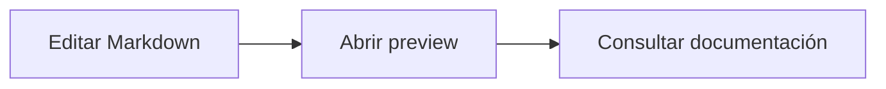

# Persistent Markdown Preview

**Mantén tu documentación abierta justo donde la dejaste.**

Persistent Markdown Preview es una extensión de Visual Studio Code para abrir varias vistas previas Markdown independientes. Cada pestaña permanece asociada a su documento y conserva su posición de lectura mientras trabajas en otros archivos, incluso con documentos que todavía no has guardado.

Desarrollada por [Smartsys](https://smartsys.mx/).

Este proyecto fue desarrollado con ayuda de inteligencia artificial, utilizando Codex para la implementación y las mejoras de la extensión, bajo la dirección de Smartsys.

[Marketplace](https://marketplace.visualstudio.com/items?itemName=smartsys-mx.persistent-markdown-preview) · [Reportar un problema](https://github.com/j4vs/persistent-markdown-preview/issues) · [Historial de cambios](https://github.com/j4vs/persistent-markdown-preview/blob/main/CHANGELOG.md)

## Características

- **Previews independientes.** Abre varios documentos o varias vistas del mismo archivo, cada una con su propio scroll.
- **Documentos sin guardar.** Funciona con archivos Markdown y documentos Untitled en modo Markdown.
- **Lectura desde el cursor.** Las nuevas previews inician cerca de la línea del cursor. Después conservan su posición sin seguir al editor.
- **Actualización en vivo.** Los cambios del documento se reflejan en sus previews sin volver al inicio.
- **Navegación por secciones.** Encabezados plegables e índice lateral cuando hay espacio; en ventanas estrechas, el índice se abre desde un botón.
- **Código con resaltado.** Bloques con encabezado de lenguaje, copia con un clic y resaltado de sintaxis.
- **Tablas fáciles de consultar.** Copia de la tabla en Markdown y encabezados fijos durante el desplazamiento.
- **Diagramas Mermaid.** Renderizado local de bloques `mermaid`, sin servicios externos.
- **Tipografía configurable.** Ajusta el tamaño del texto y las fuentes del contenido y del código.

## Instalación

Requiere **Visual Studio Code 1.95 o posterior**. No necesitas Node.js ni Obsidian para utilizar la extensión.

Busca **Persistent Markdown Preview** de **Smartsys** en el panel de extensiones o utiliza su identificador:

```sh
code --install-extension smartsys-mx.persistent-markdown-preview
```

Si tienes un archivo `.vsix`, también puedes instalarlo desde **Extensiones → … → Instalar desde VSIX…**.

## Primeros pasos

1. Abre un archivo `.md` o crea un documento nuevo y selecciona **Markdown** como lenguaje.
2. Ejecuta **Persistent Markdown Preview: Open Preview** desde la paleta de comandos.
3. La preview se abre como una pestaña en el mismo grupo del editor: `[Preview] archivo.md`.
4. Cambia de archivo o abre otras previews. Cada una mantiene su documento y su posición de lectura.

También puedes abrir una preview desde el botón del editor, el menú contextual o el atajo de teclado:

| Plataforma | Atajo |
| --- | --- |
| Windows / Linux | `Ctrl+Shift+Alt+V` |
| macOS | `Cmd+Shift+Alt+V` |

Los atajos se pueden modificar desde la configuración de métodos abreviados de VS Code.

### Comandos

| Comando | Comportamiento |
| --- | --- |
| **Persistent Markdown Preview: Open Preview** | Siempre crea una preview nueva. Las vistas adicionales del mismo documento se distinguen con `(2)`, `(3)`, etc. |
| **Persistent Markdown Preview: Open or Reveal Preview** | Enfoca una preview existente del documento o crea una si todavía no hay ninguna. |

### Índice y secciones plegables

El índice aparece a la derecha cuando hay suficiente espacio. Puedes ocultarlo para concentrarte en la lectura y recuperarlo con **Mostrar índice**. En ventanas estrechas funciona como un menú que se cierra al seleccionar una sección.

Usa el chevron junto a un encabezado para contraer o expandir su contenido. Aparece al pasar el cursor sobre un encabezado expandido y permanece visible cuando está contraído. También puedes activarlo con el teclado. La navegación desde el índice abre los apartados necesarios para mostrar el destino.

### Tablas y bloques de código

El ícono de copia de una tabla aparece al pasar el cursor sobre su encabezado o al enfocar el botón con el teclado. Copia el Markdown original, incluidos enlaces y formato.

Los bloques de código muestran el lenguaje declarado y un botón de copia siempre visible. La copia contiene el código, sin las comillas triples. Los lenguajes desconocidos o sin especificar se muestran como texto plano.

Ambos controles muestran una confirmación durante dos segundos. Sus encabezados permanecen visibles mientras recorres el contenido y dejan de estar fijos al llegar al final del bloque o tabla.

### Mermaid

Usa un bloque con lenguaje `mermaid`:

````markdown

````

El diagrama se actualiza al editar su definición. Si contiene un error de sintaxis, se muestra un aviso y el código original para poder corregirlo. El botón del encabezado permite copiar la definición.

## Configuración

En **Ajustes**, busca **Persistent Markdown Preview**. Los cambios se aplican a las previews abiertas.

| Opción | Valor predeterminado | Descripción |
| --- | --- | --- |
| `persistentMarkdownPreview.fontSize` | `14` | Tamaño base en píxeles, entre 8 y 48. |
| `persistentMarkdownPreview.textFontFamily` | `""` | Fuente del texto. Vacío utiliza la fuente de interfaz de VS Code. |
| `persistentMarkdownPreview.codeFontFamily` | `""` | Fuente del código inline y los bloques. Vacío utiliza la fuente del editor. |

Ejemplo en `settings.json`:

```json
{
  "persistentMarkdownPreview.fontSize": 15,
  "persistentMarkdownPreview.textFontFamily": "Inter, sans-serif",
  "persistentMarkdownPreview.codeFontFamily": "Cascadia Code, Consolas, monospace"
}
```

Las fuentes deben estar instaladas en tu equipo. La preview utiliza una paleta oscura fija inspirada en AnuPpuccin Mocha, con títulos de colores y un ancho máximo de lectura de 980 px. Los colores no cambian con el tema de VS Code.

## Comportamiento y limitaciones

- **Persistencia:** cada preview guarda su scroll, secciones plegadas e índice. El estado se recupera cuando VS Code restaura la pestaña. Si el archivo ya no está disponible, se conserva la última instantánea del contenido.
- **Cambios de nombre o ubicación:** al guardar un Untitled por primera vez, usar Guardar como o renombrar un archivo, abre una preview desde el nuevo documento para continuar recibiendo sus cambios. La preview anterior conserva su asociación original.
- **Scroll:** la posición se guarda en píxeles. Si el documento se acorta considerablemente, la posición puede quedar limitada por su nueva altura. Cambiar el título de una sección puede reiniciar su estado de plegado.
- **Imágenes:** las rutas relativas se resuelven desde la carpeta del archivo guardado, dentro del espacio de trabajo o de su carpeta. Los documentos Untitled no tienen un directorio base. Las imágenes remotas requieren conexión.
- **Contenido:** el HTML embebido está deshabilitado. No se ejecutan enlaces JavaScript ni comandos de VS Code desde el Markdown. No se incluye KaTeX ni checkboxes interactivos.

## Soporte y sugerencias

Para reportar errores o proponer mejoras, [abre un issue en GitHub](https://github.com/j4vs/persistent-markdown-preview/issues). Incluye la versión de la extensión y de VS Code, tu sistema operativo, los pasos para reproducir el problema y, si es posible, un ejemplo Markdown sin información confidencial.

## Desarrollo y contribuciones

Consulta [CONTRIBUTING.md](https://github.com/j4vs/persistent-markdown-preview/blob/main/CONTRIBUTING.md) para preparar el entorno, ejecutar la extensión con **F5**, correr las pruebas y generar el `.vsix`.

## Licencia

[MIT](https://github.com/j4vs/persistent-markdown-preview/blob/main/LICENSE) · Copyright © 2026 Smartsys.

Esta extensión utiliza Markdown-it, Mermaid y Highlight.js. Los avisos y licencias de sus dependencias se incluyen en [THIRD_PARTY_NOTICES.txt](https://github.com/j4vs/persistent-markdown-preview/blob/main/THIRD_PARTY_NOTICES.txt).
