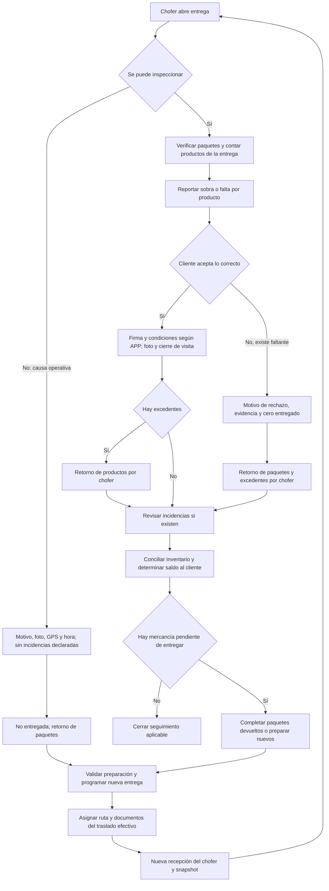

# Entrega

```mermaid
flowchart TD
  A[Chofer abre entrega] --> B{Se puede inspeccionar}
  B -->|No: causa operativa| C[Motivo, foto, GPS y hora; sin incidencias declaradas]
  C --> D[No entregada; retorno de paquetes]
  B -->|Sí| E[Verificar paquetes y contar productos de la entrega]
  E --> F[Reportar sobra o falta por producto]
  F --> G{Cliente acepta lo correcto}
  G -->|Sí| H[Firma y condiciones según APP; foto y cierre de visita]
  G -->|No, existe faltante| I[Motivo de rechazo, evidencia y cero entregado]
  I --> J[Retorno de paquetes y excedentes por chofer]
  H --> K{Hay excedentes}
  K -->|Sí| L[Retorno de productos por chofer]
  K -->|No| M[Revisar incidencias si existen]
  J --> M
  L --> M
  M --> N[Conciliar inventario y determinar saldo al cliente]
  N --> O{Hay mercancía pendiente de entregar}
  O -->|No| P[Cerrar seguimiento aplicable]
  O -->|Sí| Q[Completar paquetes devueltos o preparar nuevos]
  Q --> R[Validar preparación y programar nueva entrega]
  R --> S[Asignar ruta y documentos del traslado efectivo]
  S --> T[Nueva recepción del chofer y snapshot]
  T --> A
  D --> R
```
